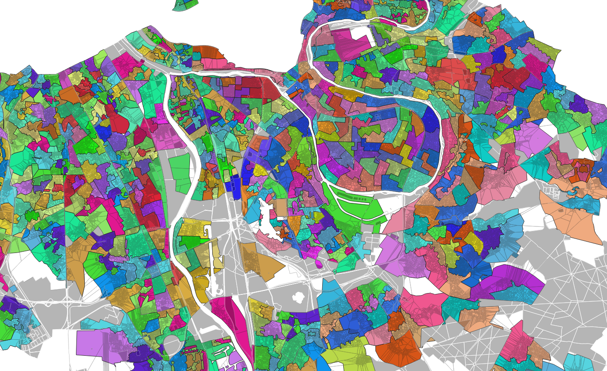

# Automated reconstruction of french polling stations using `postgis`

This is a fork from [an original attempt](https://github.com/makinacorpus/bureaux-de-vote-reconstruction) which tackles most of the work. We just made this reproducible.



# Script shell with docker

We found the [original repository](https://github.com/makinacorpus/bureaux-de-vote-reconstruction) to be incrediby useful, yet we still lost a fair amount of time to reproduce its results.

Here's a first attempt at making it easier:

Just type `./make-bureaux-votes.sh help` and you should see the following:


```shell
$ ./make-bureaux-votes.sh help                                                                                                                                                                                                                                      
██████╗░██╗░░░██╗██████╗░███████╗░█████╗░██╗░░░██╗██╗░░██╗  ██████╗░███████╗  ██╗░░░██╗░█████╗░████████╗███████╗
██╔══██╗██║░░░██║██╔══██╗██╔════╝██╔══██╗██║░░░██║╚██╗██╔╝  ██╔══██╗██╔════╝  ██║░░░██║██╔══██╗╚══██╔══╝██╔════╝
██████╦╝██║░░░██║██████╔╝█████╗░░███████║██║░░░██║░╚███╔╝░  ██║░░██║█████╗░░  ╚██╗░██╔╝██║░░██║░░░██║░░░█████╗░░
██╔══██╗██║░░░██║██╔══██╗██╔══╝░░██╔══██║██║░░░██║░██╔██╗░  ██║░░██║██╔══╝░░  ░╚████╔╝░██║░░██║░░░██║░░░██╔══╝░░
██████╦╝╚██████╔╝██║░░██║███████╗██║░░██║╚██████╔╝██╔╝╚██╗  ██████╔╝███████╗  ░░╚██╔╝░░╚█████╔╝░░░██║░░░███████╗
╚═════╝░░╚═════╝░╚═╝░░╚═╝╚══════╝╚═╝░░╚═╝░╚═════╝░╚═╝░░╚═╝  ╚═════╝░╚══════╝  ░░░╚═╝░░░░╚════╝░░░░╚═╝░░░╚══════╝
Usage: ./make-bureaux-votes.sh [command] [options]
Available commands:
  load: Download the polling center data.
  setup: Start a PostGIS server in a Docker container.
  init: Initialize the database with polling center data.
  geos: Download and import geographic data.
  connect: Open a connection to the PostgreSQL database.
  import-map: Download and import OpenStreetMap data for France. Only after init, setup, imports.
  transform: Execute a series of SQL scripts to process and transform the data. Only after init, setup, imports.
  make-bureaux: Create geometric contours for the polling stations. Only after init, setup, imports.
  post-process: Post-process the data by executing a series of SQL scripts. Only after init, setup, imports.
  pre-install: Install necessary software including Docker and Postgres, and start the Docker service. Only after init, setup, imports.
  export: Export the results to a .csv file, and copy the file from the Docker container to the host machine. Only after init, setup, imports.

Order of execution (type `all` to execute all these commands in the specific order):
(1) load
(2) pre-install
(3) setup
(4) init
(5) geos
(6) transform
(7) export
```